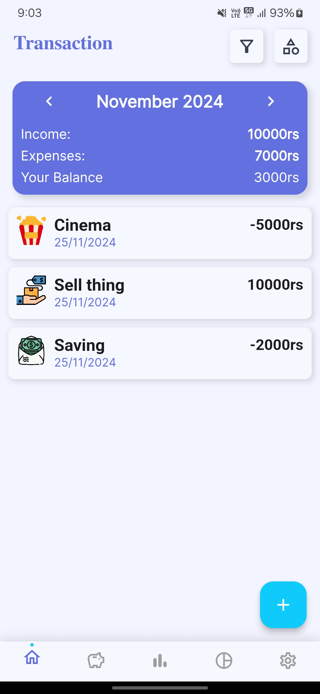
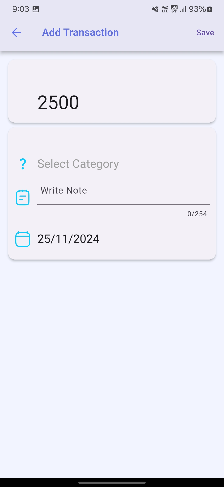
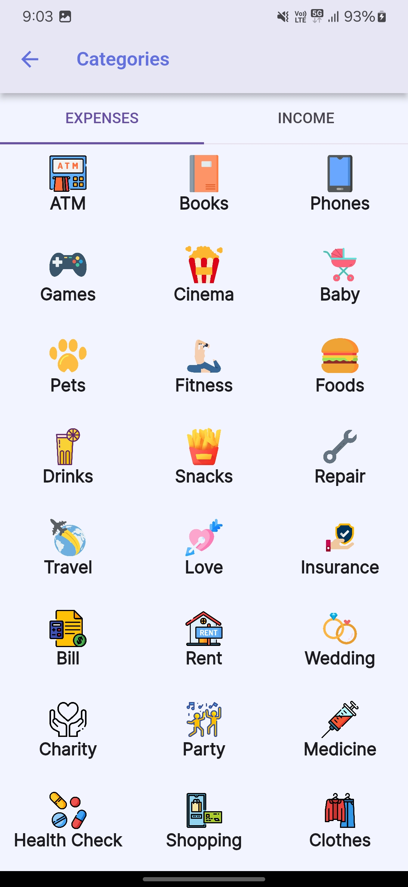
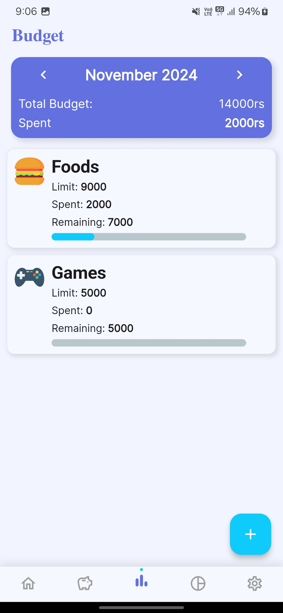
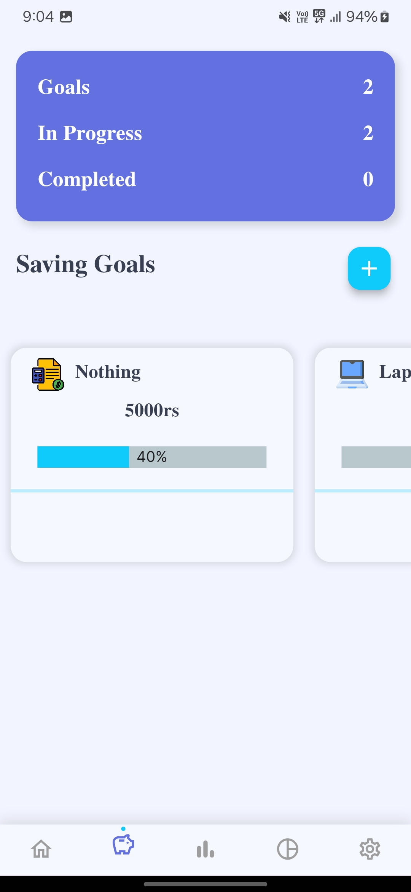
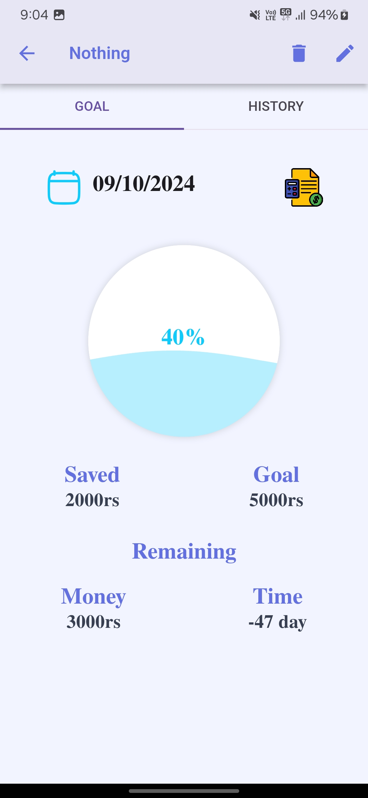
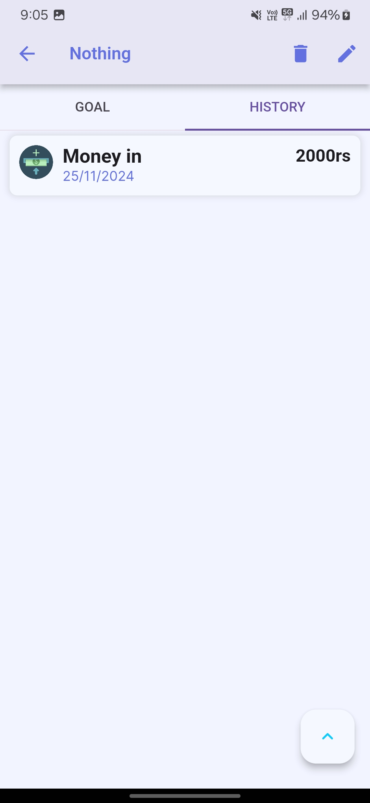
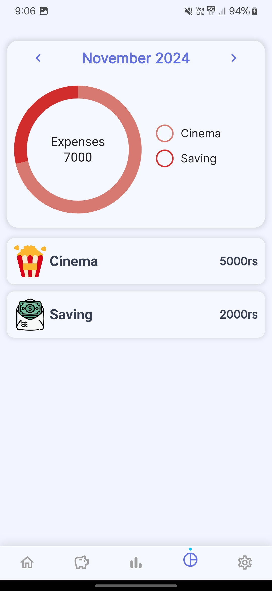
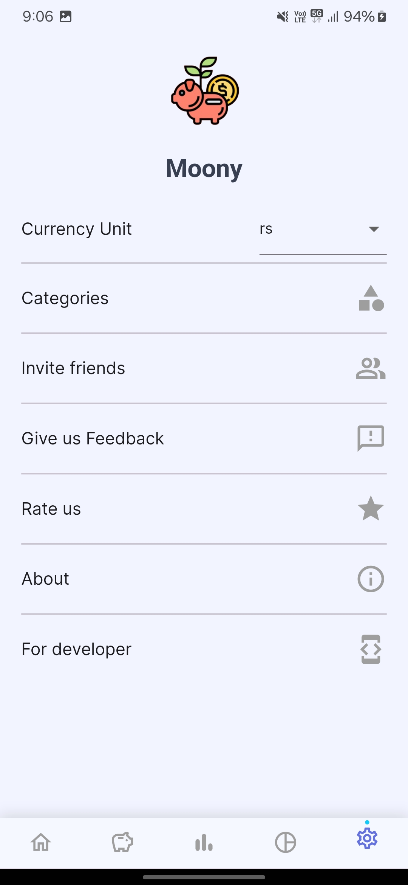

# Moony App

Moony is a personal finance app that helps users track daily transactions, manage budgets, monitor savings, and analyze expenses through intuitive dashboards. The design is inspired by [moony-calc](https://github.com/doctor-blue/moony-calc).

## Built using

The app is built using [Flutter](https://flutter.dev/) for cross-platform development and [Firebase](https://firebase.google.com/) for backend services.

## Features

- [**Track Daily Transactions** - Keep a detailed record of your income and expenses.](#track-daily-transactions)
- [**Manage Monthly Budgets** - Set, track, and stay within your budget limits.](#manage-monthly-budgets)
- [**Monitor Your Savings** - Visualize progress toward financial goals.](#monitor-your-savings)
- [**Analyze with Dashboards** - Get insights with category-wise breakdowns.](#analyze-with-dashboards)

   ### Track Daily Transactions
    Keep a detailed record of your daily income and expenses. Easily log transactions and categorize them for better organization and financial insight.
    

      
      &nbsp;&nbsp;&nbsp;
      
      &nbsp;&nbsp;&nbsp;
      
    

   ### Manage Monthly Budgets
    Set monthly budgets for different categories and track your spending to stay on top of your financial goals. Get alerts if you’re close to exceeding your budget.
    

      
    

   ### Monitor Your Savings
    Monitor your savings progress in real-time. Stay motivated by visualizing how close you are to reaching your financial milestones.
    

      
      &nbsp;&nbsp;&nbsp;
      
      &nbsp;&nbsp;&nbsp;
      
    

    ### Analyze with Dashboards
    Analyze your spending and earnings with a clean and intuitive dashboard. Get a complete overview of your financial activity, including category-wise breakdowns and trends.
    

      
      &nbsp;&nbsp;&nbsp;
      
    

